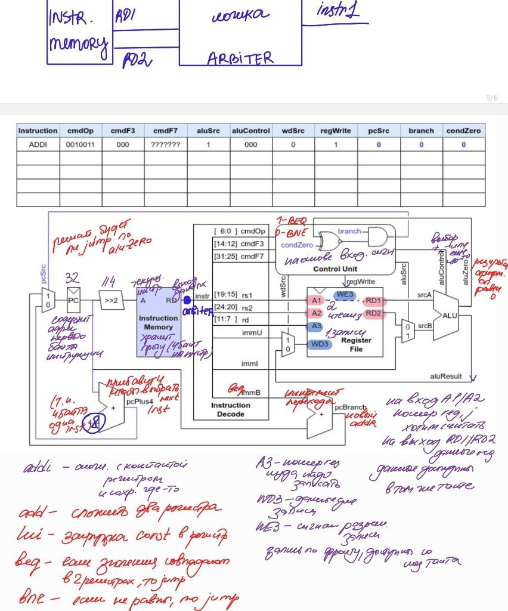

# schoolRISCV

Tiny RISCV CPU. Originally based on Sarah L. Harris MIPS CPU ("Digital Design and Computer Arhitecture" by David Money Harris and Sarah L Harris) and [schoolMIPS](https://github.com/MIPSfpga/schoolMIPS) project. Supports only a subset of RISCV commands.

## Docs

[HDL Tools Install](install/readme.md)

[Video (Russian)](https://www.youtube.com/watch?v=w1F6aHfiuZ0&list=PL7J5ZgBGsxn6rquSuWO07kUk_YJrQnXec)

[Slides (Russian)](https://raw.githubusercontent.com/wiki/zhelnio/schoolRISCV/doc/schoolRISCV_slides_ru.pdf)

[New Instruction Example (Russian)](https://raw.githubusercontent.com/wiki/zhelnio/schoolRISCV/doc/schoolRISCV_steps_ru.pdf)

[RISC-V ISA Specification](https://raw.githubusercontent.com/wiki/zhelnio/schoolRISCV/doc/riscv-spec-20191213.pdf)

**НАШЕ ЗАДАНИЕ**
*Основное задание:*
1. Модифицировать процессорное ядро, в соответствии с вашим вариантом;
2. Подготовить тестовое окружение системного уровня и убедиться в корректности вашей реализации путём запуска симуляционных тестов.

**Примечание:**  При непосредственном описании ваших модификаций в коде проекта, запрещено использовать симуляционные конструкции и арифметические операции, отличные от сложения и вычитания (то есть, умножение, деление и возведение в степень реализуйте сами посредством описания любого, понравившегося вам, алгоритма). В тестовом окружении использовать симуляционные конструкции и всевозможные арифметические операции можно (и даже нужно).

Варианты с арбитром должны реализовать однотактовую выборку двух инструкций и их арбитраж в остальную часть процессорного ядра. Вместо того, чтобы выбирать и исполнять одну инструкцию - процессорное ядро должно выбирать две инструкции одновременно и управлять их доступом к исполняемому ресурсу ядра.

**Основная часть для вариантов с арбитром:**
1. Внесите модификации в процессорное ядро, позволяющие ему выбирать две инструкции из памяти команд за один такт. Так как процессорное ядро однотактовое, то сформируйте симуляционную задержку между подачей первой и второй инструкции в остальную часть ядра, таким образом, чтобы команды не терялись;
2. Скомпилируйте программу, с арифметическими инструкциями. Убедитесь, что
она корректно выровнена и содержит корректные поля. Проведите тестирование
с использованием этой программы. По результатам тестирования вы должны
быть уверенны в корректности внесенных модификаций;
3. В рамках следующего этапа рекомендуется ввести логику арбитража двух выбранных инструкций, заменив искусственно-введенную симуляционную задержку. Встройте свой модуль из предыдущей лабораторной работы, сократив количество потоков до двух. Проведите тестирование.
4. Разберитесь с тем, какие конфликты могут возникать при арбитраже двух команд и, если нужно, внесите в модуль арбитра логику, разрешающую такие конфликты;
5. Проведите комплексное системное тестирование модифицированного процессорного ядра. Тестирование не должно быть полным — достаточно будет того, чтобы
оно покрывало все исключительные ситуации и краевые точки ваших областей
эквивалентности

